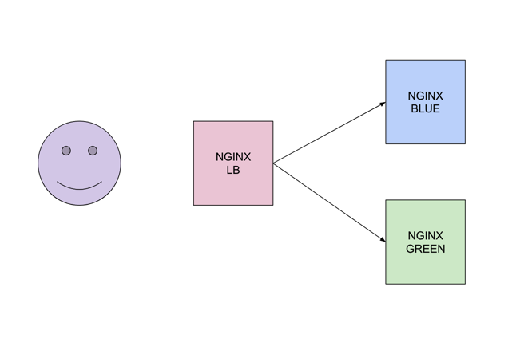

# This repo is an example of blue/green deployment.

## How it works

- The repo contain two modules "blue" and "green" only one of these modules will have a non-zero count. When you deploy both set to non-zero count both will be available on the output IPs but only one will be accessible trough the Load Balancer. When you change the count to zero and apply changes the particular module will become non-active and the other will be available on the "load_balancer_dns" address.



## How to use it 

- clone the repo 
```
$ git clone https://github.com/chavo1/blue-green-nginx.git
$ cd blue-green-nginx
```
- Add your credentials and AWS security group into an example "terraform.tfvars"
```
$ terraform init
$ terraform apply
```
- change the count to 0 of blue module located in folder blue/main.tf
```
count         = 0
```
- After applying the changes the green server will be available on the "load_balancer_dns" from TF output.
- You can do the same with blue module
- Do not forget to destroy the environment
```
$ terraform destroy
```


